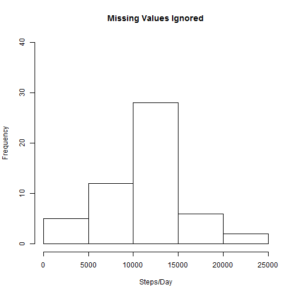
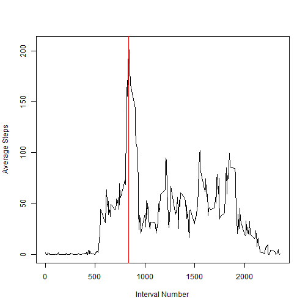
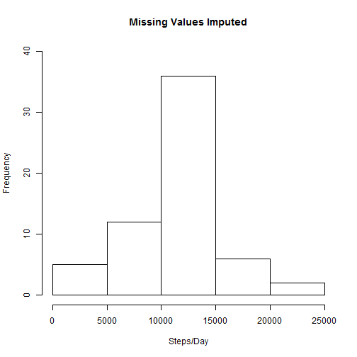
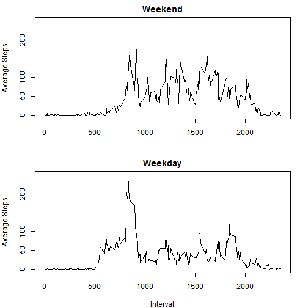

# Reproducible Research
## Peer Assessment 1


### Loading and preprocessing the data

Data is loaded and processed using the getDateTime() function to create a modified dataframe. (Scroll to the end of this document to view the source code for this function.)


```r
#load the data
data <- read.csv("activity.csv")
newdata <- getDateTime(data)
```


### What is mean total number of steps taken per day?

1. Make a histogram of the total number of steps taken each day


```r
#Total steps each day
steps<-aggregate(newdata$steps,by=list(Date = newdata$date),sum)
#Histogram
hist(steps$x,ylim=c(0,40), xlab="Steps/Day",main="Missing Values Ignored")
```

 


2. Calculate and report the mean and median total number of steps taken
per day


```r
#mean steps per day
meansteps <- mean(steps$x,na.rm=T)
#median steps
mediansteps <- median(steps$x, na.rm=T)
```

The mean of the total number of steps is **10766.19** and the median of the total number of steps is **10765**.

### What is the average daily activity pattern?

1. Make a time series plot (i.e. type = "l") of the 5-minute interval (x-axis)
and the average number of steps taken, averaged across all days (y-axis)


```r
na_mean <- function(x){mean(x,na.rm=T)}
tssteps<-aggregate(newdata$steps,by=list(Interval = newdata$interval),na_mean)
peak=which(tssteps$x == max(tssteps$x))

plot(tssteps$Interval,tssteps$x,type="l",xlab="Interval Number", ylab="Average Steps")
abline(v=tssteps$Interval[peak], col="red")
```

 


2. Which 5-minute interval, on average across all the days in the dataset, contains the maximum number of steps?


```r
#Interval with the largest avaerage number of steps:
peak_interval <- tssteps$Interval[peak]
```
The interval that contains the maximum number of steps, on average, is **835**.

### Imputing missing values

1. Calculate and report the total number of missing values in the dataset
(i.e. the total number of rows with NAs)

```r
totalNA <- sum(is.na(data))
```

The total number of missing values in the data set is **2304**.

2. Devise a strategy for filling in all of the missing values in the dataset. The
strategy does not need to be sophisticated. For example, you could use
the mean/median for that day, or the mean for that 5-minute interval, etc.

The following function (fillNA.R) replaces all the NA values with the mean values for that 5-minute interval:


```
## 
## > fillNA <- function(d,means){
## +         
## +         #find the missing (NA) values
## +         filled<-d
## +         missing <- which(is.na(d$steps)==T)
## +         
## +         #loop through the missing values and insert the mean for that time interval
## +         for(i in 1:length(missing)){
## +                 int <- d[missing[i],]$interval
## +                 value <- means$x[means$Interval==int]
## +                 filled[missing[i],]$steps <- value
## +         }
## +         return(filled)
## +         
## + }
```


3. Create a new dataset that is equal to the original dataset but with the
missing data filled in.


```r
filled <- fillNA(newdata,tssteps)
```


4. Make a histogram of the total number of steps taken each day and Calculate
and report the mean and median total number of steps taken per day. 

```r
stepsf<-aggregate(filled$steps,by=list(Date = filled$date),sum)
hist(stepsf$x,ylim=c(0,40), xlab="Steps/Day", main="Missing Values Imputed")
```

 

```r
#mean steps per day
meansteps <- mean(stepsf$x)
#median steps
mediansteps <- median(stepsf$x)
```

The mean of the total number of steps is **10766.19** and the median of the total number of steps is **10766.19**.

a. Do these values differ from the estimates from the first part of the assignment?

Because of the strategy chosen (filling in the missing values with the mean for that interval), the mean values are unchanged.  However, the median is now exactly equal to the mean, whereas before it was slightly less.

b. What is the impact of imputing missing data on the estimates of the total
daily number of steps?


```r
sum_imputed <- sum(stepsf$x)
sum_ignored <- sum(steps$x, na.rm=T)
```

The total number of daily steps when missing data are imputed is **656738**, whereas the total number of daily steps when missing data are ignored is much smaler, **570608**.


### Are there differences in activity patterns between weekdays and weekends?

It appears that the weekday steps have a pronounced peak (on average) at around 8:30 AM (interval 835) whereas the steps during the weekend are more spread out during the day. See the plot of this behavior, below.


```r
day_of_week <- format(newdata$date.time, format="%a")
weekend <-(day_of_week == "Sat" | day_of_week == "Sun")
tswe<-aggregate(newdata$steps[weekend],by=list(Interval = newdata$interval[weekend]),na_mean)
tswd<-aggregate(newdata$steps[!weekend],by=list(Interval = newdata$interval[!weekend]),na_mean)

#plot the results
par(mar=c(4,4,2,2),mfrow=c(2,1))
plot(tswe$Interval,tswe$x,type="l",ylim=c(0,250),ylab="Average Steps",xlab="", main="Weekend")
plot(tswd$Interval,tswd$x,type="l",ylim=c(0,250),ylab="Average Steps",xlab="Interval",main="Weekdays")
```

 

----
### getDateTime.R

This function was used to convert the 5-minutes interval data into a date and time (beginning of interval):


```
## 
## > getDateTime <- function(data){
## +    
## +         #The step interval in this dataset is awkward. This function converts it into a time (beginning of interval)
## +         dates <- data$date
## +         int <- data$interval
## +         
## +         mint <- int %/% 100
## +         newint <- paste0(mint,":",int-mint*100)
## +         datetime <- strptime(paste0(dates,newint),format="%Y-%m-%d %H:%M")
## +         
## +         #merge this with the original data as a new column
## +         newdata <- data.frame(data, date.time=datetime)
## +         newdata
## + }
```
